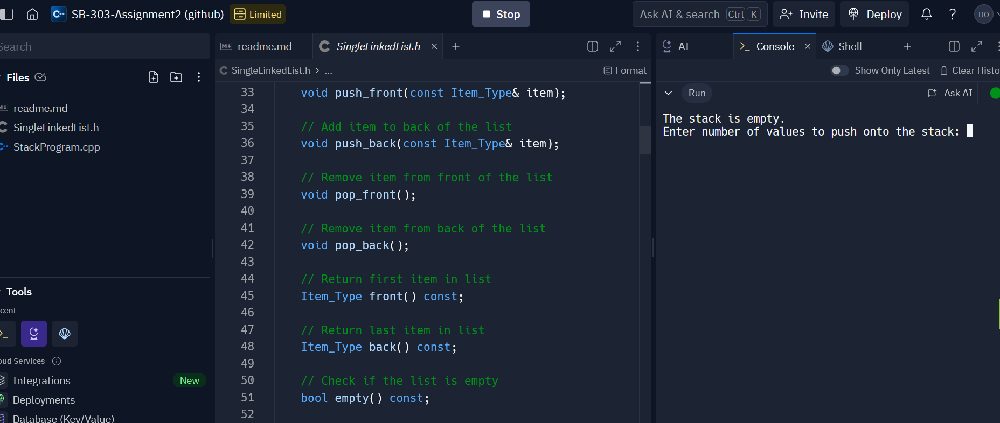
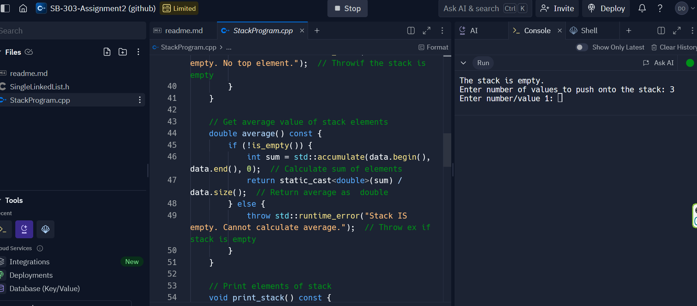
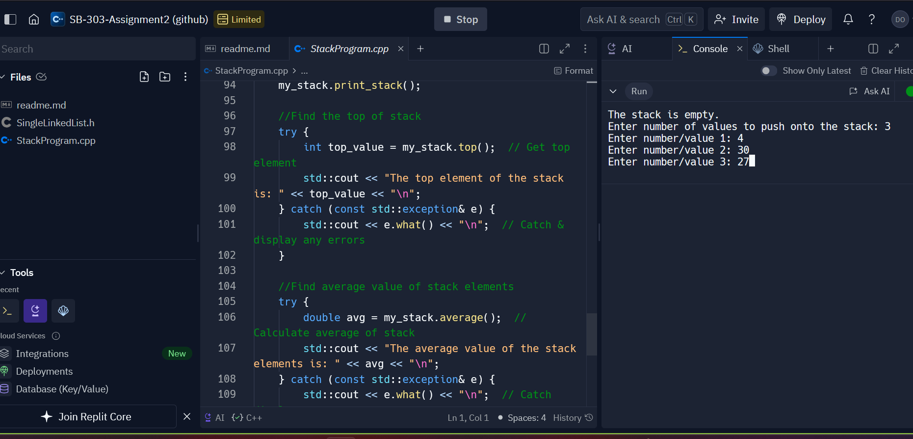
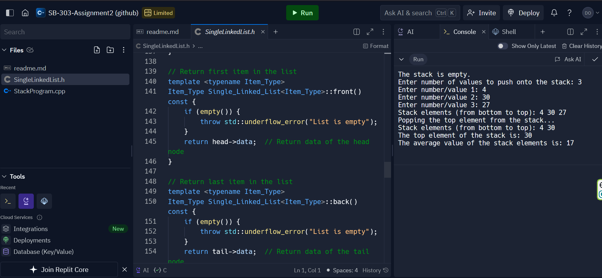

**********README**********

This C++ program implements a stack of integers using a vector.

The program consists of:
StackProgram.cpp
SingleLInkedList.h

*This function will:

Create a stack object.
Check if the stack is empty.
Insert integer values onto the stack.
Remove the top element from the stack.
Find the top element of the stack.
Calculate the average of the stack elements.

*The program can:

Push: Adds an element to the top of the stack.
Pop: Removes the element from the top of the stack.
Top: Retrieves the top element without removing it.
Average: Calculates the average of all elements in the stack.

*How to use?*
It checks whether the stack is empty.
Several integers that you input are pushed onto the stack.
The top element is popped from the stack, and the stack is displayed.
The current top element is retrieved.
Then the average value of the remaining elements is calculated

